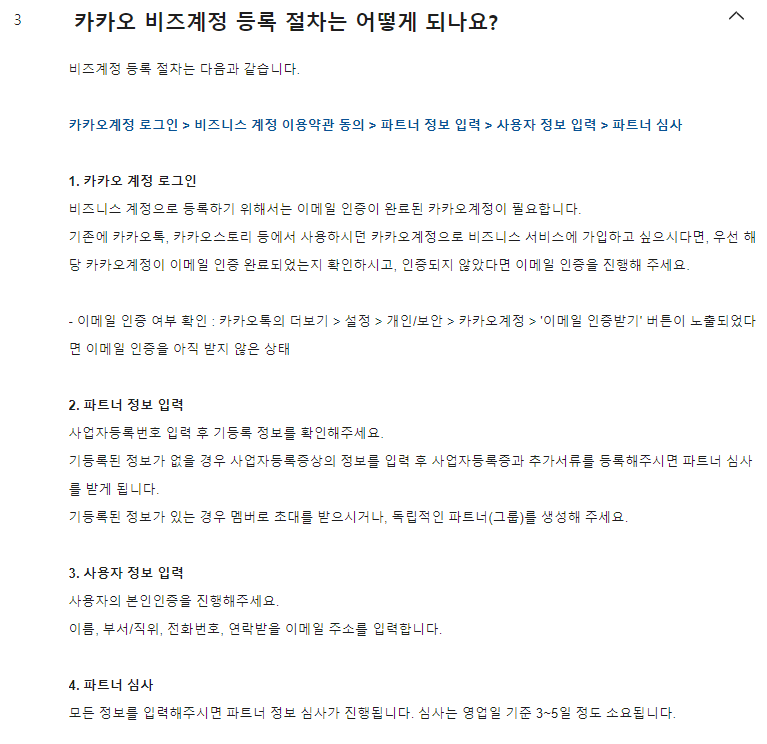
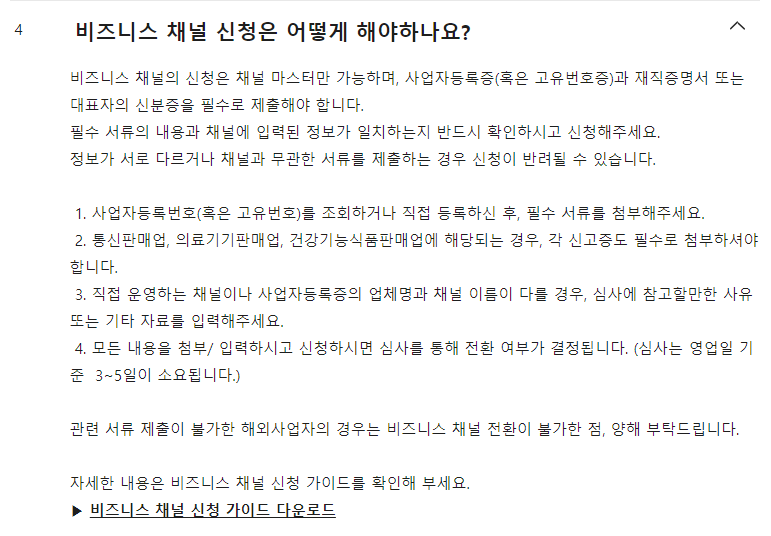
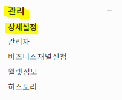
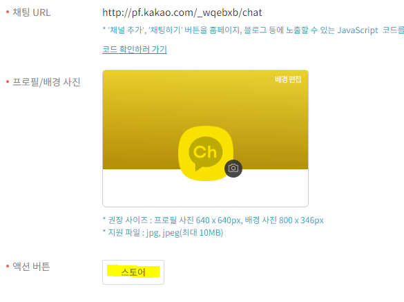
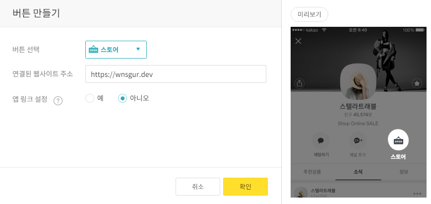
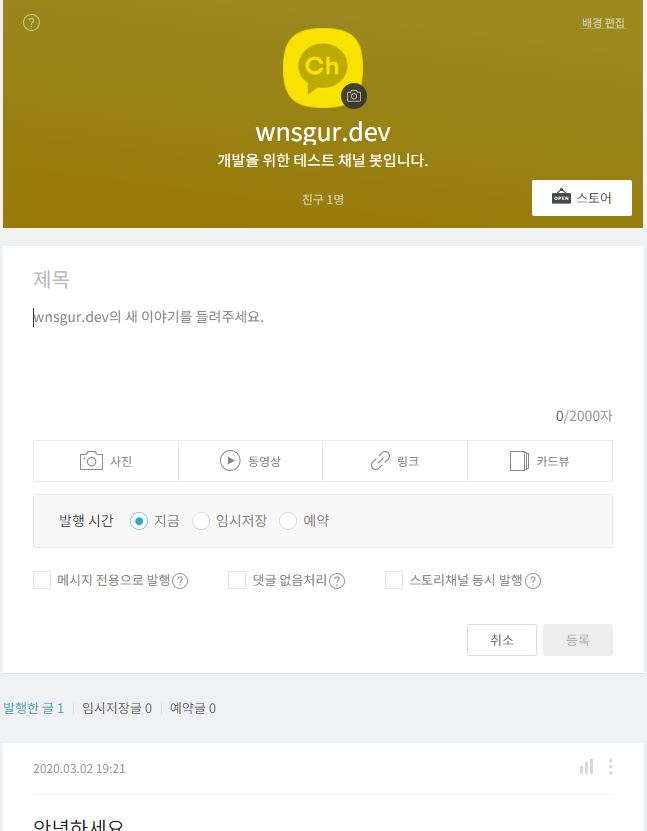

> 카카오톡 채널 챗봇 관련 조사 및 정리 문서입니다.  
> 카카오 아이디가 이미 생성되어 있단 전제로 진행합니다.

# 1. 카카오 비즈 계정 생성
[https://biz.kakao.com/](https://biz.kakao.com/) 사이트에 접속하셔서, 기존에 가입했던 카카오 계정으로 로그인합니다.

그러면 다음과 같은 절차로 비즈 계정을 등록합니다.

카카오계정 로그인 > 비즈니스 계정 이용약관 동의 > 파트너 정보 입력 > 사용자 정보 입력 > 파트너 심사

*참고*
- 

- [비즈 계정 생성 참조](https://cs.kakao.com/helps?articleId=1073191787&service=34&category=398&device=1224&locale=ko#1073191787)

# 2. 카카오톡 채널 생성

[https://business.kakao.com/info/kakaotalkchannel/](https://business.kakao.com/info/kakaotalkchannel/) 에서 카카오톡 채널을 생성할 수 있습니다.

아래 메뉴를 따라 접속하면 비즈니스 채널 신청하는 페이지가 나옵니다.

왼쪽 사이드 바 메뉴 > 관리 > 비즈니스 채널 신청

*참고*
- 
- [비즈니스 채널 신청 가이드](https://cs.kakao.com/helps?articleId=1073193248&service=102&category=282&device=1688&locale=ko#1073193248)

# 3. 액션 버튼 생성

## 3. 1 사이드 바 메뉴 > 상세 설정

## 3. 2 오른쪽 화면 > 액션 버튼 생성 클릭

## 3.3 설정

# (Optional) 포스트

왼쪽 사이드바 > 포스트 > 작성하면 유저들에게 전할 정보를 포스팅 할 수 있습니다.

# demo
- [링크](http://pf.kakao.com/_wqebxb
) 혹은 카카오톡 친구 검색 > `wnsgur` 검색어를 이용하면 카카오톡 채널 봇을 확인 가능
- 스토어 버튼을 클릭하면 지정한 웹 사이트 url로 이동

# 참조
- [카카오 비즈 계정 생성](https://cs.kakao.com/helps?articleId=1073191787&service=34&category=398&device=1224&locale=ko)
- [카카오 비즈니스 채널](https://cs.kakao.com/helps?service=102&category=282&device=1688&locale=ko)
- [기프티스타 회사 인터뷰](https://outstanding.kr/todaystartup/?action=readpost&post_id=424190&bbspaged=2)
- [카카오톡 채널](https://business.kakao.com/info/kakaotalkchannel/)